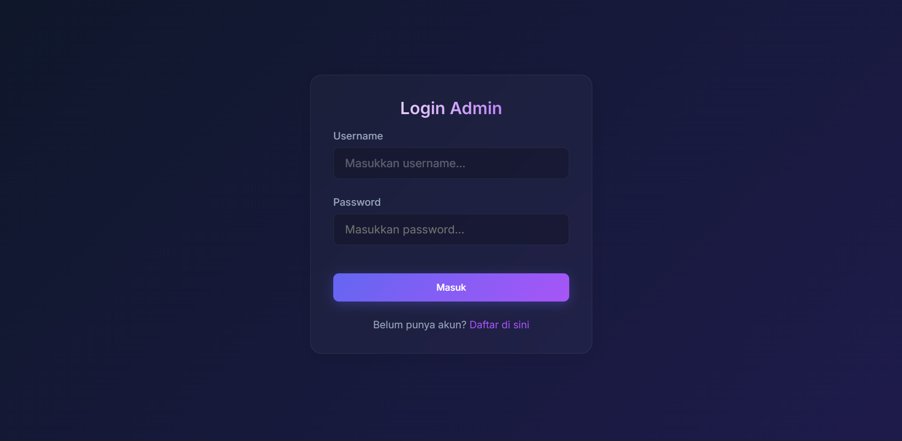
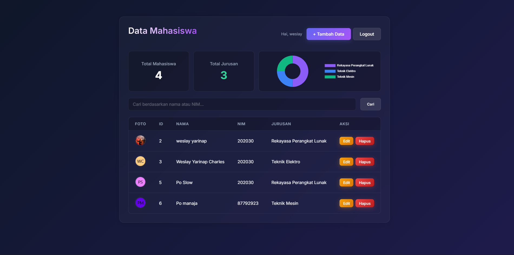

# Aplikasi Manajemen Data Mahasiswa - PHP Native

Aplikasi berbasis web sederhana untuk mengelola data mahasiswa (CRUD) menggunakan **PHP Native** tanpa framework, dikombinasikan dengan database **MySQL**. Aplikasi ini dilengkapi dengan sistem autentikasi (Registrasi & Login), pencarian otomatis berdasarkan NIM/Nama, serta visualisasi data menggunakan chart/diagram.

---

## 🚀 Fitur Utama

1. **Sistem Autentikasi Keamanan:** User diwajibkan untuk membuat akun (**Register**) terlebih dahulu sebelum bisa masuk (**Login**) ke dalam dashboard admin.
2. **Manajemen Data (CRUD):** Tambah, lihat, ubah, dan hapus data mahasiswa lengkap dengan foto profil.
3. **Validasi & Proteksi Upload File:** Keamanan unggah gambar otomatis mendeteksi ekstensi file (`.jpg`, `.jpeg`, `.png`, `.gif`) dan melakukan *rename* nama file secara unik (`uniqid()`) untuk menghindari duplikasi atau tabrakan nama file di server.
4. **Pencarian Otomatis:** Fitur pencarian data mahasiswa berdasarkan **Nama** atau **NIM**. Ketika kata kunci dimasukkan, sistem menyaring data yang sesuai secara responsif.
5. **Statistik Dashboard Modern:** Menampilkan total mahasiswa, jumlah jurusan, serta visualisasi distribusi jurusan menggunakan *Pie Chart* berpenampilan modern (*Dark Mode UI*).

---

## 📸 Tampilan Antarmuka (UI)

Berikut adalah screenshot tampilan aplikasi untuk mempermudah pemahaman alur sistem:

### 1. Halaman Login Admin
Halaman login dengan desain *glassmorphism* modern bernuansa *dark mode* dan aksen neon ungu untuk autentikasi admin sebelum masuk ke sistem.



### 2. Dashboard Data Mahasiswa
Dashboard utama yang menampilkan metrik jumlah mahasiswa, variasi jurusan, diagram lingkaran distribusi jurusan, kolom pencarian, serta tabel aksi CRUD lengkap dengan foto profil mahasiswa.



> 💡 **Petunjuk Menampilkan Gambar:** Supaya kedua gambar di atas muncul otomatis di halaman GitHub Anda, buatlah sebuah folder bernama `screenshots` di dalam proyek Git Anda. Pindahkan file gambar **image_5bfefd.png** dan **image_5c020c.jpg** ke dalam folder `screenshots` tersebut, lalu lakukan push ke GitHub.

---

## 📂 Struktur Proyek

```text
WEB PHP NATIV/
│
├── assets/             # File CSS, JS, dan library pihak ketiga (Chart.js)
├── screenshots/        # Tempat menyimpan gambar screenshot UI aplikasi
│   ├── image_5bfefd.png
│   └── image_5c020c.jpg
│
├── config/
│   └── koneksi.php     # Konfigurasi koneksi ke database MySQL
│
├── includes/           # Komponen layout terpisah (header.php, footer.php, dll)
├── uploads/            # Direktori penyimpanan file foto mahasiswa yang diunggah
│
├── index.php           # Halaman utama / Dashboard Utama Data Mahasiswa
├── login.php           # Halaman Login Admin[cite: 1]
├── register.php        # Halaman Registrasi Akun Admin Baru[cite: 1]
├── logout.php          # Proses penghapusan session login (Log out)[cite: 1]
│
├── tambah.php          # Form & logika PHP untuk tambah data mahasiswa[cite: 1]
├── edit.php            # Form & logika PHP untuk edit/update data mahasiswa[cite: 1]
└── hapus.php           # Logika PHP untuk hapus data mahasiswa berdasarkan ID[cite: 1]
